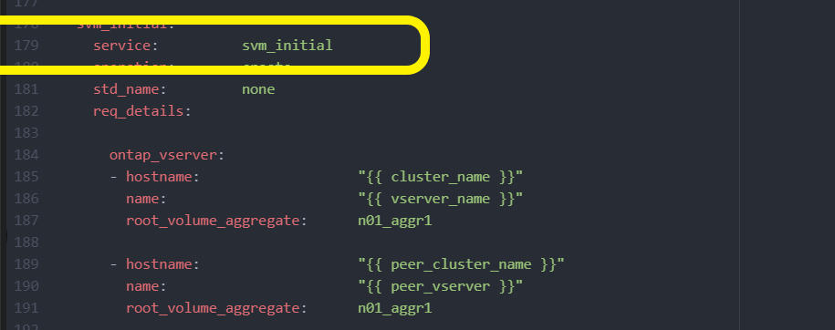

= Implementieren Sie den ONTAP Cluster mit der Lösung
:hardbreaks:
:allow-uri-read: 
:nofooter: 
:icons: font
:linkattrs: 
:imagesdir: ../media/

[role="lead"]
Nach Abschluss der Vorbereitung und Planung sind Sie bereit, mit der ONTAP Day 0/1 Lösung schnell einen ONTAP Cluster mithilfe von Ansible zu konfigurieren.

Sie können jederzeit während der Schritte in diesem Abschnitt auswählen, ob Sie eine Anforderung testen möchten, anstatt sie tatsächlich auszuführen. Um eine Anforderung zu testen, ändern Sie das `site.yml` Playbook in der Befehlszeile in `logic.yml`.

NOTE: Der `docs/tutorial-requests.txt` Speicherort enthält die endgültige Version aller Service-Requests, die während dieses Verfahrens verwendet werden. Wenn Sie Schwierigkeiten bei der Ausführung einer Service-Anfrage haben, können Sie die entsprechende Anforderung aus der Datei an den `playbooks/inventory/group_vars/all/tutorial-requests.yml` Speicherort kopieren `tutorial-requests.txt` und die hartcodierten Werte nach Bedarf ändern (IP-Adresse, Aggregatnamen usw.). Die Anforderung sollte dann erfolgreich ausgeführt werden können.

== Bevor Sie beginnen

* Ansible muss installiert sein.
* Sie müssen die ONTAP Day 0/1-Lösung heruntergeladen und den Ordner an den gewünschten Speicherort auf dem Ansible-Steuerungsknoten extrahiert haben.
* Der ONTAP-Systemstatus muss die Anforderungen erfüllen und Sie müssen über die erforderlichen Anmeldedaten verfügen.
* Sie müssen alle erforderlichen Aufgaben abgeschlossen haben, die im  Abschnitt beschrieben link:ontap-day01-prepare.html["Vorbereiten"]sind.

NOTE: Die Beispiele in dieser Lösung verwenden „Cluster_01“ und „Cluster_02“ als Namen für die beiden Cluster. Sie müssen diese Werte durch die Namen der Cluster in Ihrer Umgebung ersetzen.

== Schritt: Erstkonfiguration des Clusters

In dieser Phase müssen Sie zunächst einige Schritte zur Cluster-Konfiguration durchführen.

.Schritte
. Navigieren Sie zum `playbooks/inventory/group_vars/all/tutorial-requests.yml` Speicherort und prüfen Sie die `cluster_initial` Anforderung in der Datei. Nehmen Sie alle erforderlichen Änderungen an Ihrer Umgebung vor.
. Erstellen Sie eine Datei im `logic-tasks` Ordner für die Service-Anfrage. Erstellen Sie beispielsweise eine Datei mit dem Namen `cluster_initial.yml`.
+
Kopieren Sie die folgenden Zeilen in die neue Datei:

+
[source, cli]
----
- name: Validate required inputs
  ansible.builtin.assert:
    that:
    - service is defined

- name: Include data files
  ansible.builtin.include_vars:
    file:   "{{ data_file_name }}.yml"
  loop:
  - common-site-stds
  - user-inputs
  - cluster-platform-stds
  - vserver-common-stds
  loop_control:
    loop_var:    data_file_name

- name: Initial cluster configuration
  set_fact:
    raw_service_request:
----
. Definieren Sie die `raw_service_request` Variable.
+
Sie können eine der folgenden Optionen verwenden, um die Variable in der Datei zu `cluster_initial.yml` definieren `raw_service_request`, die Sie im Ordner erstellt `logic-tasks` haben:

+
** *Option 1*: Variable manuell definieren `raw_service_request`.
+
Öffnen Sie die `tutorial-requests.yml` Datei mit einem Editor und kopieren Sie den Inhalt von Zeile 11 in Zeile 165. Fügen Sie den Inhalt unter der Variablen in der neuen `cluster_initial.yml` Datei ein `raw service request`, wie in den folgenden Beispielen gezeigt:

+
image::../media/cluster_initial_line.png[Bild der zu kopierenden Zeile]

+
.Beispiel anzeigen
[%collapsible]
====
Beispieldatei `cluster_initial.yml`:

[listing]
----
- name: Validate required inputs
  ansible.builtin.assert:
    that:
    - service is defined

- name: Include data files
  ansible.builtin.include_vars:
    file:   "{{ data_file_name }}.yml"
  loop:
  - common-site-stds
  - user-inputs
  - cluster-platform-stds
  - vserver-common-stds
  loop_control:
    loop_var:    data_file_name

- name: Initial cluster configuration
  set_fact:
    raw_service_request:
     service:          cluster_initial
     operation:         create
     std_name:           none
     req_details:

      ontap_aggr:
      - hostname:                   "{{ cluster_name }}"
        disk_count:                 24
        name:                       n01_aggr1
        nodes:                      "{{ cluster_name }}-01"
        raid_type:                  raid4

      - hostname:                   "{{ peer_cluster_name }}"
        disk_count:                 24
        name:                       n01_aggr1
        nodes:                      "{{ peer_cluster_name }}-01"
        raid_type:                  raid4

      ontap_license:
      - hostname:                   "{{ cluster_name }}"
        license_codes:
        - XXXXXXXXXXXXXXAAAAAAAAAAAAAA
        - XXXXXXXXXXXXXXAAAAAAAAAAAAAA
        - XXXXXXXXXXXXXXAAAAAAAAAAAAAA
        - XXXXXXXXXXXXXXAAAAAAAAAAAAAA
        - XXXXXXXXXXXXXXAAAAAAAAAAAAAA
        - XXXXXXXXXXXXXXAAAAAAAAAAAAAA
        - XXXXXXXXXXXXXXAAAAAAAAAAAAAA
        - XXXXXXXXXXXXXXAAAAAAAAAAAAAA
        - XXXXXXXXXXXXXXAAAAAAAAAAAAAA
        - XXXXXXXXXXXXXXAAAAAAAAAAAAAA
        - XXXXXXXXXXXXXXAAAAAAAAAAAAAA
        - XXXXXXXXXXXXXXAAAAAAAAAAAAAA
        - XXXXXXXXXXXXXXAAAAAAAAAAAAAA
        - XXXXXXXXXXXXXXAAAAAAAAAAAAAA
        - XXXXXXXXXXXXXXAAAAAAAAAAAAAA
        - XXXXXXXXXXXXXXAAAAAAAAAAAAAA
        - XXXXXXXXXXXXXXAAAAAAAAAAAAAA
        - XXXXXXXXXXXXXXAAAAAAAAAAAAAA
        - XXXXXXXXXXXXXXAAAAAAAAAAAAAA
        - XXXXXXXXXXXXXXAAAAAAAAAAAAAA
        - XXXXXXXXXXXXXXAAAAAAAAAAAAAA
        - XXXXXXXXXXXXXXAAAAAAAAAAAAAA
        - XXXXXXXXXXXXXXAAAAAAAAAAAAAA
        - XXXXXXXXXXXXXXAAAAAAAAAAAAAA
        - XXXXXXXXXXXXXXAAAAAAAAAAAAAA
        - XXXXXXXXXXXXXXAAAAAAAAAAAAAA
        - XXXXXXXXXXXXXXAAAAAAAAAAAAAA
        - XXXXXXXXXXXXXXAAAAAAAAAAAAAA
        - XXXXXXXXXXXXXXAAAAAAAAAAAAAA
        - XXXXXXXXXXXXXXAAAAAAAAAAAAAA
        - XXXXXXXXXXXXXXAAAAAAAAAAAAAA

    - hostname:                   "{{ peer_cluster_name }}"
      license_codes:
        - XXXXXXXXXXXXXXAAAAAAAAAAAAAA
        - XXXXXXXXXXXXXXAAAAAAAAAAAAAA
        - XXXXXXXXXXXXXXAAAAAAAAAAAAAA
        - XXXXXXXXXXXXXXAAAAAAAAAAAAAA
        - XXXXXXXXXXXXXXAAAAAAAAAAAAAA
        - XXXXXXXXXXXXXXAAAAAAAAAAAAAA
        - XXXXXXXXXXXXXXAAAAAAAAAAAAAA
        - XXXXXXXXXXXXXXAAAAAAAAAAAAAA
        - XXXXXXXXXXXXXXAAAAAAAAAAAAAA
        - XXXXXXXXXXXXXXAAAAAAAAAAAAAA
        - XXXXXXXXXXXXXXAAAAAAAAAAAAAA
        - XXXXXXXXXXXXXXAAAAAAAAAAAAAA
        - XXXXXXXXXXXXXXAAAAAAAAAAAAAA
        - XXXXXXXXXXXXXXAAAAAAAAAAAAAA
        - XXXXXXXXXXXXXXAAAAAAAAAAAAAA
        - XXXXXXXXXXXXXXAAAAAAAAAAAAAA
        - XXXXXXXXXXXXXXAAAAAAAAAAAAAA
        - XXXXXXXXXXXXXXAAAAAAAAAAAAAA
        - XXXXXXXXXXXXXXAAAAAAAAAAAAAA
        - XXXXXXXXXXXXXXAAAAAAAAAAAAAA
        - XXXXXXXXXXXXXXAAAAAAAAAAAAAA
        - XXXXXXXXXXXXXXAAAAAAAAAAAAAA
        - XXXXXXXXXXXXXXAAAAAAAAAAAAAA
        - XXXXXXXXXXXXXXAAAAAAAAAAAAAA
        - XXXXXXXXXXXXXXAAAAAAAAAAAAAA
        - XXXXXXXXXXXXXXAAAAAAAAAAAAAA
        - XXXXXXXXXXXXXXAAAAAAAAAAAAAA
        - XXXXXXXXXXXXXXAAAAAAAAAAAAAA
        - XXXXXXXXXXXXXXAAAAAAAAAAAAAA
        - XXXXXXXXXXXXXXAAAAAAAAAAAAAA

    ontap_motd:
    - hostname:                   "{{ cluster_name }}"
      vserver:                    "{{ cluster_name }}"
      message:                    "New MOTD"

    - hostname:                   "{{ peer_cluster_name }}"
      vserver:                    "{{ peer_cluster_name }}"
      message:                    "New MOTD"

    ontap_interface:
    - hostname:                   "{{ cluster_name }}"
      vserver:                    "{{ cluster_name }}"
      interface_name:             ic01
      role:                       intercluster
      address:                    10.0.0.101
      netmask:                    255.255.255.0
      home_node:                  "{{ cluster_name }}-01"
      home_port:                  e0c
      ipspace:                    Default
      use_rest:                   never

    - hostname:                   "{{ cluster_name }}"
      vserver:                    "{{ cluster_name }}"
      interface_name:             ic02
      role:                       intercluster
      address:                    10.0.0.101
      netmask:                    255.255.255.0
      home_node:                  "{{ cluster_name }}-01"
      home_port:                  e0c
      ipspace:                    Default
      use_rest:                   never

    - hostname:                   "{{ peer_cluster_name }}"
      vserver:                    "{{ peer_cluster_name }}"
      interface_name:             ic01
      role:                       intercluster
      address:                    10.0.0.101
      netmask:                    255.255.255.0
      home_node:                  "{{ peer_cluster_name }}-01"
      home_port:                  e0c
      ipspace:                    Default
      use_rest:                   never

    - hostname:                   "{{ peer_cluster_name }}"
      vserver:                    "{{ peer_cluster_name }}"
      interface_name:             ic02
      role:                       intercluster
      address:                    10.0.0.101
      netmask:                    255.255.255.0
      home_node:                  "{{ peer_cluster_name }}-01"
      home_port:                  e0c
      ipspace:                    Default
      use_rest:                   never

    ontap_cluster_peer:
    - hostname:                   "{{ cluster_name }}"
      dest_cluster_name:          "{{ peer_cluster_name }}"
      dest_intercluster_lifs:     "{{ peer_lifs }}"
      source_cluster_name:        "{{ cluster_name }}"
      source_intercluster_lifs:   "{{ cluster_lifs }}"
      peer_options:
        hostname:                 "{{ peer_cluster_name }}"

----
====
** *Option 2*: Verwenden Sie eine Jinja-Vorlage, um die Anforderung zu definieren:
+
Sie können auch das folgende Jinja-Vorlagenformat verwenden, um den Wert zu erhalten `raw_service_request`.

+
`raw_service_request:      "{{ cluster_initial }}"`

. Führen Sie die Erstkonfiguration des Clusters für das erste Cluster durch:
+
[source, cli]
----
ansible-playbook -i inventory/hosts site.yml -e cluster_name=<Cluster_01>
----
+
Vergewissern Sie sich, dass keine Fehler vorliegen, bevor Sie fortfahren.

. Wiederholen Sie den Befehl für das zweite Cluster:
+
[source, cli]
----
ansible-playbook -i inventory/hosts site.yml -e cluster_name=<Cluster_02>
----
+
Vergewissern Sie sich, dass beim zweiten Cluster keine Fehler auftreten.

+
Wenn Sie zu Beginn der Ansible-Ausgabe nach oben scrollen, sollten Sie die an das Framework gesendete Anforderung sehen, wie im folgenden Beispiel gezeigt:

+
.Beispiel anzeigen
[%collapsible]
====
[listing]
----
TASK [Show the raw_service_request] ************************************************************************************************************
ok: [localhost] => {
    "raw_service_request": {
        "operation": "create",
        "req_details": {
            "ontap_aggr": [
                {
                    "disk_count": 24,
                    "hostname": "Cluster_01",
                    "name": "n01_aggr1",
                    "nodes": "Cluster_01-01",
                    "raid_type": "raid4"
                }
            ],
            "ontap_license": [
                {
                    "hostname": "Cluster_01",
                    "license_codes": [
                        "XXXXXXXXXXXXXXXAAAAAAAAAAAA",
                        "XXXXXXXXXXXXXXAAAAAAAAAAAAA",
                        "XXXXXXXXXXXXXXAAAAAAAAAAAAA",
                        "XXXXXXXXXXXXXXAAAAAAAAAAAAA",
                        "XXXXXXXXXXXXXXAAAAAAAAAAAAA",
                        "XXXXXXXXXXXXXXAAAAAAAAAAAAA",
                        "XXXXXXXXXXXXXXAAAAAAAAAAAAA",
                        "XXXXXXXXXXXXXXAAAAAAAAAAAAA",
                        "XXXXXXXXXXXXXXAAAAAAAAAAAAA",
                        "XXXXXXXXXXXXXXAAAAAAAAAAAAA",
                        "XXXXXXXXXXXXXXAAAAAAAAAAAAA",
                        "XXXXXXXXXXXXXXAAAAAAAAAAAAA",
                        "XXXXXXXXXXXXXXAAAAAAAAAAAAA",
                        "XXXXXXXXXXXXXXAAAAAAAAAAAAA",
                        "XXXXXXXXXXXXXXAAAAAAAAAAAAA",
                        "XXXXXXXXXXXXXXAAAAAAAAAAAAA",
                        "XXXXXXXXXXXXXXAAAAAAAAAAAAA",
                        "XXXXXXXXXXXXXXAAAAAAAAAAAAA",
                        "XXXXXXXXXXXXXXAAAAAAAAAAAAA",
                        "XXXXXXXXXXXXXXAAAAAAAAAAAAA",
                        "XXXXXXXXXXXXXXAAAAAAAAAAAAA",
                        "XXXXXXXXXXXXXXAAAAAAAAAAAAA",
                        "XXXXXXXXXXXXXXAAAAAAAAAAAAA",
                        "XXXXXXXXXXXXXXAAAAAAAAAAAAA",
                        "XXXXXXXXXXXXXXAAAAAAAAAAAAA",
                        "XXXXXXXXXXXXXXAAAAAAAAAAAAA",
                        "XXXXXXXXXXXXXXAAAAAAAAAAAAA",
                        "XXXXXXXXXXXXXXAAAAAAAAAAAAA",
                        "XXXXXXXXXXXXXXAAAAAAAAAAAAA",
                        "XXXXXXXXXXXXXXAAAAAAAAAAAAA",
                        "XXXXXXXXXXXXXXAAAAAAAAAAAAA",
                        "XXXXXXXXXXXXXXAAAAAAAAAAAAA",
                        "XXXXXXXXXXXXXXAAAAAAAAAAAAA",
                        "XXXXXXXXXXXXXXAAAAAAAAAAAAA"
                    ]
                }
            ],
            "ontap_motd": [
                {
                    "hostname": "Cluster_01",
                    "message": "New MOTD",
                    "vserver": "Cluster_01"
                }
            ]
        },
        "service": "cluster_initial",
        "std_name": "none"
    }
}
----
====
. Melden Sie sich bei jeder ONTAP-Instanz an und überprüfen Sie, ob die Anforderung erfolgreich war.

== Schritt 2: Konfigurieren der Intercluster LIFs

Sie können jetzt die Intercluster LIFs konfigurieren, indem Sie der Anforderung die LIF-Definitionen hinzufügen `cluster_initial` und den Microservice definieren `ontap_interface`.

Die Servicedefinition und die Anforderung arbeiten zusammen, um die Aktion zu bestimmen:

* Wenn Sie eine Service-Anfrage für einen Microservice bereitstellen, der nicht in den Servicedefinitionen enthalten ist, wird die Anforderung nicht ausgeführt.
* Wenn Sie eine Service-Anfrage mit einer oder mehreren in den Servicedefinitionen definierten Microservices bereitstellen, aber aus der Anfrage ausgelassen werden, wird die Anforderung nicht ausgeführt.

Das `execution.yml` Playbook wertet die Dienstdefinition aus, indem die Liste der Microservices in der aufgeführten Reihenfolge durchsucht wird:

* Wenn in der Anfrage ein Eintrag mit einem Wörterbuchschlüssel vorhanden ist, der dem Eintrag in den Microservice-Definitionen entspricht `args`, wird die Anforderung ausgeführt.
* Wenn in der Service-Anfrage kein übereinstimmender Eintrag vorhanden ist, wird die Anforderung fehlerfrei übersprungen.

.Schritte
. Navigieren Sie zu der `cluster_initial.yml` zuvor erstellten Datei, und ändern Sie die Anforderung, indem Sie den Anforderungsdefinitionen die folgenden Zeilen hinzufügen:
+
[source, cli]
----
    ontap_interface:
    - hostname:                   "{{ cluster_name }}"
      vserver:                    "{{ cluster_name }}"
      interface_name:             ic01
      role:                       intercluster
      address:                    <ip_address>
      netmask:                    <netmask_address>
      home_node:                  "{{ cluster_name }}-01"
      home_port:                  e0c
      ipspace:                    Default
      use_rest:                   never

    - hostname:                   "{{ cluster_name }}"
      vserver:                    "{{ cluster_name }}"
      interface_name:             ic02
      role:                       intercluster
      address:                    <ip_address>
      netmask:                    <netmask_address>
      home_node:                  "{{ cluster_name }}-01"
      home_port:                  e0c
      ipspace:                    Default
      use_rest:                   never

    - hostname:                   "{{ peer_cluster_name }}"
      vserver:                    "{{ peer_cluster_name }}"
      interface_name:             ic01
      role:                       intercluster
      address:                    <ip_address>
      netmask:                    <netmask_address>
      home_node:                  "{{ peer_cluster_name }}-01"
      home_port:                  e0c
      ipspace:                    Default
      use_rest:                   never

    - hostname:                   "{{ peer_cluster_name }}"
      vserver:                    "{{ peer_cluster_name }}"
      interface_name:             ic02
      role:                       intercluster
      address:                    <ip_address>
      netmask:                    <netmask_address>
      home_node:                  "{{ peer_cluster_name }}-01"
      home_port:                  e0c
      ipspace:                    Default
      use_rest:                   never
----
. Führen Sie den Befehl aus:
+
[source, cli]
----
ansible-playbook -i inventory/hosts  site.yml -e cluster_name=<Cluster_01> -e peer_cluster_name=<Cluster_02>
----
. Melden Sie sich bei jeder Instanz an, um zu überprüfen, ob die LIFs dem Cluster hinzugefügt wurden:
+
.Beispiel anzeigen
[%collapsible]
====
[listing]
----
Cluster_01::> net int show
  (network interface show)
            Logical    Status     Network            Current       Current Is
Vserver     Interface  Admin/Oper Address/Mask       Node          Port    Home
----------- ---------- ---------- ------------------ ------------- ------- ----
Cluster_01
            Cluster_01-01_mgmt up/up 10.0.0.101/24   Cluster_01-01 e0c     true
            Cluster_01-01_mgmt_auto up/up 10.101.101.101/24 Cluster_01-01 e0c true
            cluster_mgmt up/up    10.0.0.110/24      Cluster_01-01 e0c     true
5 entries were displayed.
----
====
+
Die Ausgabe zeigt an, dass die LIFs *nicht* hinzugefügt wurden. Der Grund dafür ist, dass der `ontap_interface` Microservice noch in der Datei definiert werden `services.yml` muss.

. Vergewissern Sie sich, dass die LIFs der Variable hinzugefügt wurden `raw_service_request`.
+
.Beispiel anzeigen
[%collapsible]
====
Im folgenden Beispiel werden die LIFs zur Anforderung hinzugefügt:

[listing]
----
           "ontap_interface": [
                {
                    "address": "10.0.0.101",
                    "home_node": "Cluster_01-01",
                    "home_port": "e0c",
                    "hostname": "Cluster_01",
                    "interface_name": "ic01",
                    "ipspace": "Default",
                    "netmask": "255.255.255.0",
                    "role": "intercluster",
                    "use_rest": "never",
                    "vserver": "Cluster_01"
                },
                {
                    "address": "10.0.0.101",
                    "home_node": "Cluster_01-01",
                    "home_port": "e0c",
                    "hostname": "Cluster_01",
                    "interface_name": "ic02",
                    "ipspace": "Default",
                    "netmask": "255.255.255.0",
                    "role": "intercluster",
                    "use_rest": "never",
                    "vserver": "Cluster_01"
                },
                {
                    "address": "10.0.0.101",
                    "home_node": "Cluster_02-01",
                    "home_port": "e0c",
                    "hostname": "Cluster_02",
                    "interface_name": "ic01",
                    "ipspace": "Default",
                    "netmask": "255.255.255.0",
                    "role": "intercluster",
                    "use_rest": "never",
                    "vserver": "Cluster_02"
                },
                {
                    "address": "10.0.0.126",
                    "home_node": "Cluster_02-01",
                    "home_port": "e0c",
                    "hostname": "Cluster_02",
                    "interface_name": "ic02",
                    "ipspace": "Default",
                    "netmask": "255.255.255.0",
                    "role": "intercluster",
                    "use_rest": "never",
                    "vserver": "Cluster_02"
                }
            ],
----
====
. Definieren Sie den `ontap_interface` Microservice unter `cluster_initial` in der `services.yml` Datei.
+
Kopieren Sie die folgenden Zeilen in die Datei, um den Microservice zu definieren:

+
[source, cli]
----
        - name: ontap_interface
          args: ontap_interface
          role: na/ontap_interface
----
. Nachdem nun der `ontap_interface` Microservice in der Anfrage und der Datei definiert wurde `services.yml`, führen Sie die Anforderung erneut aus:
+
[source, cli]
----
ansible-playbook -i inventory/hosts  site.yml -e cluster_name=<Cluster_01> -e peer_cluster_name=<Cluster_02>
----
. Loggen Sie sich bei jeder ONTAP Instanz ein und überprüfen Sie, ob die LIFs hinzugefügt wurden.

== Schritt 3: Optional mehrere Cluster konfigurieren

Bei Bedarf können Sie mehrere Cluster in derselben Anforderung konfigurieren. Sie müssen beim Definieren der Anforderung für jedes Cluster Variablennamen angeben.

.Schritte
. Fügen Sie einen Eintrag für das zweite Cluster in der Datei hinzu `cluster_initial.yml`, um beide Cluster in derselben Anforderung zu konfigurieren.
+
Im folgenden Beispiel wird das Feld angezeigt `ontap_aggr`, nachdem der zweite Eintrag hinzugefügt wurde.

+
[listing]
----
   ontap_aggr:
    - hostname:                   "{{ cluster_name }}"
      disk_count:                 24
      name:                       n01_aggr1
      nodes:                      "{{ cluster_name }}-01"
      raid_type:                  raid4

    - hostname:                   "{{ peer_cluster_name }}"
      disk_count:                 24
      name:                       n01_aggr1
      nodes:                      "{{ peer_cluster_name }}-01"
      raid_type:                  raid4
----
. Übernehmen Sie die Änderungen für alle anderen Elemente unter `cluster_initial`.
. Fügen Sie Cluster-Peering zur Anforderung hinzu, indem Sie die folgenden Zeilen in die Datei kopieren:
+
[source, cli]
----
    ontap_cluster_peer:
    - hostname:                   "{{ cluster_name }}"
      dest_cluster_name:          "{{ cluster_peer }}"
      dest_intercluster_lifs:     "{{ peer_lifs }}"
      source_cluster_name:        "{{ cluster_name }}"
      source_intercluster_lifs:   "{{ cluster_lifs }}"
      peer_options:
        hostname:                 "{{ cluster_peer }}"
----
. Ansible-Anforderung ausführen:
+
[source, cli]
----
ansible-playbook -i inventory/hosts -e cluster_name=<Cluster_01>
site.yml -e peer_cluster_name=<Cluster_02> -e cluster_lifs=<cluster_lif_1_IP_address,cluster_lif_2_IP_address>
-e peer_lifs=<peer_lif_1_IP_address,peer_lif_2_IP_address>
----

== Schritt 4: Anfängliche SVM-Konfiguration

An dieser Stelle des Verfahrens konfigurieren Sie die SVMs im Cluster.

.Schritte
. Anforderung `tutorial-requests.yml` zur Konfiguration einer SVM- und SVM-Peer-Beziehung aktualisieren `svm_initial`
+
Sie müssen Folgendes konfigurieren:

+
** Das SVM
** Die SVM-Peer-Beziehung
** Die SVM-Schnittstelle für jede SVM

. Aktualisieren Sie die Variablendefinitionen in den `svm_initial` Anforderungsdefinitionen. Sie müssen die folgenden Variablendefinitionen ändern:
+
** `cluster_name`
** `vserver_name`
** `peer_cluster_name`
** `peer_vserver`
+
Um die Definitionen zu aktualisieren, entfernen Sie das *‘{}’* nach `req_details` für die `svm_initial` Definition und fügen Sie die korrekte Definition hinzu.

. Erstellen Sie eine Datei im `logic-tasks` Ordner für die Service-Anfrage. Erstellen Sie beispielsweise eine Datei mit dem Namen `svm_initial.yml`.
+
Kopieren Sie die folgenden Zeilen in die Datei:

+
[source, cli]
----
- name: Validate required inputs
  ansible.builtin.assert:
    that:
    - service is defined

- name: Include data files
  ansible.builtin.include_vars:
    file:   "{{ data_file_name }}.yml"
  loop:
  - common-site-stds
  - user-inputs
  - cluster-platform-stds
  - vserver-common-stds
  loop_control:
    loop_var:    data_file_name

- name: Initial SVM configuration
  set_fact:
    raw_service_request:
----
. Definieren Sie die `raw_service_request` Variable.
+
Sie können eine der folgenden Optionen verwenden, um die Variable für `svm_initial` im Ordner zu `logic-tasks` definieren `raw_service_request`:

+
** *Option 1*: Variable manuell definieren `raw_service_request`.
+
Öffnen Sie die `tutorial-requests.yml` Datei mit einem Editor und kopieren Sie den Inhalt von Zeile 179 in Zeile 222. Fügen Sie den Inhalt unter der Variablen in der neuen `svm_initial.yml` Datei ein `raw service request`, wie in den folgenden Beispielen gezeigt:

+

+
.Beispiel anzeigen
[%collapsible]
====
Beispieldatei `svm_initial.yml`:

[listing]
----
- name: Validate required inputs
  ansible.builtin.assert:
    that:
    - service is defined

- name: Include data files
  ansible.builtin.include_vars:
    file:   "{{ data_file_name }}.yml"
  loop:
  - common-site-stds
  - user-inputs
  - cluster-platform-stds
  - vserver-common-stds
  loop_control:
    loop_var:    data_file_name

- name: Initial SVM configuration
  set_fact:
    raw_service_request:
     service:          svm_initial
     operation:        create
     std_name:         none
     req_details:

      ontap_vserver:
      - hostname:                   "{{ cluster_name }}"
        name:                       "{{ vserver_name }}"
        root_volume_aggregate:      n01_aggr1

      - hostname:                   "{{ peer_cluster_name }}"
       name:                       "{{ peer_vserver }}"
       root_volume_aggregate:      n01_aggr1

      ontap_vserver_peer:
      - hostname:                   "{{ cluster_name }}"
        vserver:                    "{{ vserver_name }}"
        peer_vserver:               "{{ peer_vserver }}"
        applications:               snapmirror
        peer_options:
          hostname:                 "{{ peer_cluster_name }}"

      ontap_interface:
      - hostname:                   "{{ cluster_name }}"
        vserver:                    "{{ vserver_name }}"
        interface_name:             data01
        role:                       data
        address:                    10.0.0.200
        netmask:                    255.255.255.0
        home_node:                  "{{ cluster_name }}-01"
        home_port:                  e0c
        ipspace:                    Default
        use_rest:                   never

      - hostname:                   "{{ peer_cluster_name }}"
        vserver:                    "{{ peer_vserver }}"
        interface_name:             data01
        role:                       data
        address:                    10.0.0.201
        netmask:                    255.255.255.0
        home_node:                  "{{ peer_cluster_name }}-01"
        home_port:                  e0c
        ipspace:                    Default
        use_rest:                   never
----
====
** *Option 2*: Verwenden Sie eine Jinja-Vorlage, um die Anforderung zu definieren:
+
Sie können auch das folgende Jinja-Vorlagenformat verwenden, um den Wert zu erhalten `raw_service_request`.

+
[listing]
----
raw_service_request: "{{ svm_initial }}"
----

. Anforderung ausführen:
+
[source, cli]
----
ansible-playbook -i inventory/hosts -e cluster_name=<Cluster_01> -e peer_cluster_name=<Cluster_02> -e peer_vserver=<SVM_02>  -e vserver_name=<SVM_01> site.yml
----
. Melden Sie sich bei jeder ONTAP Instanz an und validieren Sie die Konfiguration.
. Fügen Sie die SVM-Schnittstellen hinzu.
+
Definieren Sie den `ontap_interface` Dienst unter `svm_initial` in der `services.yml` Datei und führen Sie die Anforderung erneut aus:

+
[source, cli]
----
ansible-playbook -i inventory/hosts -e cluster_name=<Cluster_01> -e peer_cluster_name=<Cluster_02> -e peer_vserver=<SVM_02>  -e vserver_name=<SVM_01> site.yml
----
. Loggen Sie sich bei jeder ONTAP Instanz ein und überprüfen Sie, ob die SVM-Schnittstellen konfiguriert sind.

== Schritt 5: Optional können Sie eine Service-Anfrage dynamisch definieren

In den vorherigen Schritten ist die `raw_service_request` Variable hartcodiert. Dies ist nützlich für Lernen, Entwicklung und Tests. Sie können auch eine Serviceanfrage dynamisch generieren.

Der folgende Abschnitt bietet eine Option zum dynamischen Erstellen des erforderlichen `raw_service_request`, wenn Sie es nicht in höhere Systeme integrieren möchten.

[IMPORTANT]
====
* Wenn die `logic_operation` Variable im Befehl nicht definiert ist, importiert die `logic.yml` Datei keine Datei aus dem `logic-tasks` Ordner. Das bedeutet, dass die `raw_service_request` außerhalb von Ansible definiert und bei der Ausführung dem Framework zur Verfügung gestellt werden muss.
* Ein Aufgabendateiname im `logic-tasks` Ordner muss mit dem Wert der Variablen ohne die Erweiterung .yml übereinstimmen `logic_operation`.
* Die Aufgabendateien im `logic-tasks` Ordner definieren dynamisch ein `raw_service_request`. die einzige Voraussetzung ist, dass ein gültiges `raw_service_request` als letzte Aufgabe in der entsprechenden Datei definiert wird.

====
.Dynamische Definition von Service-Anfragen
Es gibt mehrere Möglichkeiten, eine logische Aufgabe anzuwenden, um eine Service-Anfrage dynamisch zu definieren. Einige dieser Optionen sind unten aufgeführt:

* Verwenden einer Ansible-Aufgabendatei aus dem `logic-tasks` Ordner
* Aufrufen einer benutzerdefinierten Rolle, die Daten zurückgibt, die für die Konvertierung in eine Variable geeignet `raw_service_request` sind.
* Aufruf eines weiteren Tools außerhalb der Ansible-Umgebung, um die erforderlichen Daten bereitzustellen Beispielsweise ein REST-API-Aufruf an Active IQ Unified Manager.

Mit den folgenden Beispielbefehlen können Sie mithilfe der Datei für jedes Cluster eine Service-Anfrage dynamisch definieren `tutorial-requests.yml`:

[source, cli]
----
ansible-playbook -i inventory/hosts -e cluster2provision=Cluster_01
-e logic_operation=tutorial-requests site.yml
----
[source, cli]
----
ansible-playbook -i inventory/hosts -e cluster2provision=Cluster_02
-e logic_operation=tutorial-requests site.yml
----

== Schritt 6: Implementierung der ONTAP-Lösung Tag 0/1

In dieser Phase sollten Sie bereits Folgendes abgeschlossen haben:

* Alle Dateien in wurden entsprechend Ihren Anforderungen überprüft und geändert `playbooks/inventory/group_vars/all`. Jede Datei enthält detaillierte Kommentare, mit denen Sie die Änderungen vornehmen können.
* Erforderliche Aufgabendateien wurden dem Verzeichnis hinzugefügt `logic-tasks`.
* Alle erforderlichen Datendateien wurden dem Verzeichnis hinzugefügt `playbook/vars`.

Verwenden Sie die folgenden Befehle, um die ONTAP Day 0/1-Lösung bereitzustellen und den Zustand Ihrer Bereitstellung zu überprüfen:

NOTE: Zu diesem Zeitpunkt sollten Sie die Datei bereits entschlüsselt und geändert haben `vault.yml` und sie muss mit Ihrem neuen Passwort verschlüsselt werden.

* Führen Sie den ONTAP-Tag-0-Service aus:
+
[source, cli]
----
ansible-playbook -i playbooks/inventory/hosts playbooks/site.yml -e logic_operation=cluster_day_0 -e service=cluster_day_0 -vvvv --ask-vault-pass <your_vault_password>
----
* Führen Sie den ONTAP Day 1-Service aus:
+
[source, cli]
----
ansible-playbook -i playbooks/inventory/hosts playbooks/site.yml -e logic_operation=cluster_day_1 -e service=cluster_day_0 -vvvv --ask-vault-pass <your_vault_password>
----
* Clusterweite Einstellungen anwenden:
+
[source, cli]
----
ansible-playbook -i playbooks/inventory/hosts playbooks/site.yml -e logic_operation=cluster_wide_settings -e service=cluster_wide_settings -vvvv --ask-vault-pass <your_vault_password>
----
* Führen Sie Zustandsprüfungen durch:
+
[source, cli]
----
ansible-playbook -i playbooks/inventory/hosts playbooks/site.yml -e logic_operation=health_checks -e service=health_checks -e enable_health_reports=true -vvvv --ask-vault-pass <your_vault_password>
----

